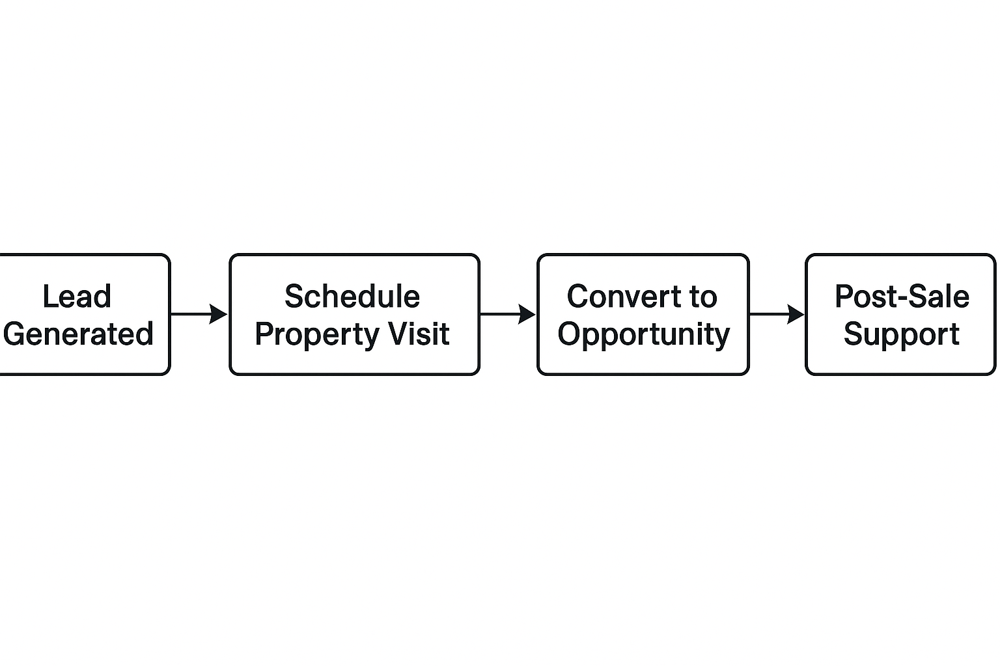

# Business Process Mapping - Real Estate CRM

## Process Flow
1. Lead generated (via website or marketing).
2. Agent contacts client.
3. Property visit scheduled.
4. Lead converted into Opportunity.
5. Deal closed → property sold.
6. Post-sale support provided.

