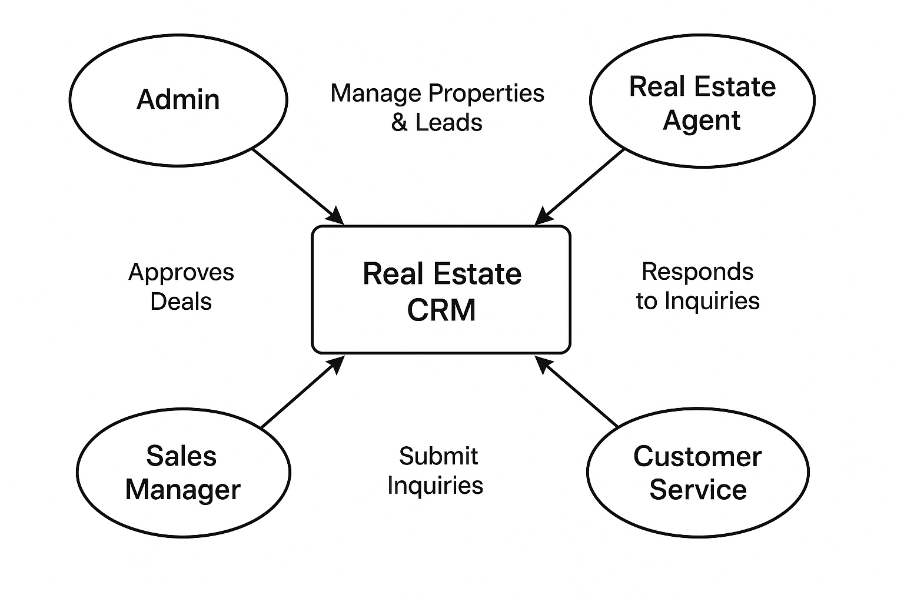

# Stakeholder Analysis - Real Estate CRM

## Stakeholders and Their Roles
- **Admin** → Configures Salesforce, manages system setup.
- **Real Estate Agents** → Manage properties, handle leads, schedule visits.
- **Sales Manager** → Monitors performance, approves big deals.
- **Customer Service** → Handles support after sale.
- **Clients/Buyers** → Send inquiries, book visits, interact via portal.

